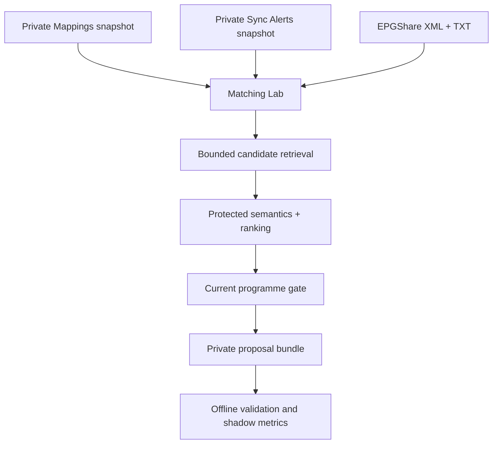

# Matching Lab design and workflow decision

## Decision

Keep production Workflows 1 and 2 as the authority, retain Workflow 3 as the
aggregate count-only backlog diagnostic, and add the Matching Lab as a
separate, proposal-only process. This hybrid is safer and more useful than
replacing the workflows or continuing to enlarge Smart Rules inside Workflow 1.

The Lab may read private snapshots and public EPGShare evidence. It cannot edit
Mappings, Sync Alerts, workflow files, or published guide output. Its only
product is private, deterministic evidence. A standalone offline command may
bind an owner's approval to one exact run and another may prepare a maximum
25-row canary. A separate standalone `apply` subcommand now exposes a narrow,
fail-closed Google Sheets writer; it is not part of the Lab runner and cannot
turn Lab output into automatic authority. It requires exact human approval and
freshly revalidates every row, provider identity, OPEN alert, catalog target,
and programme gate immediately before an atomic bounded write.

## Why the current workflows should not be replaced

| Concern | Workflows 1/2 | Workflow 3 analyzer | Matching Lab | Decision |
|---|---|---|---|---|
| Provider and Sheet races | Guarded writes and terminal rereads | Live read-only access | Frozen snapshots | Keep Workflows 1/2 authoritative |
| Public guide generation | Mature deployment | Out of scope | Out of scope | Keep Workflow 2 unchanged |
| Backlog visibility | Run summaries | Public-safe aggregate counts | Private per-row evidence | Retain 3; use Lab for diagnosis |
| Candidate discovery | Scheduled and bounded | Existing classifications | Indexed multi-signal retrieval | Use the Lab for experiments |
| Replay and history | Limited rotation | No private row history | Content-addressed bundles and local history | Use the Lab |
| Credentials | Production credentials | Read-only Sheet/provider credentials | Files only; optional local AI key | Prefer Lab isolation |
| Sheet mutation | Allowlisted writer | No write operation | Lab has no writer; separate approval CLI applies at most 25 | Keep the write lane narrow and manual |
| Human approval | Existing Sheet state | Out of scope | Exact run-bound private package, full-ID confirmation, and live guards | Never treat a proposal or prepared batch as authority |
| Rollback | Coupled to production run | Ignore count report | Ignore private bundle | Prefer Lab for experiments |

Moving all work to a new autonomous writer would duplicate the hardest safety
logic. The narrow approval lane instead reuses the production validation and
Sheet-update primitives for provider revalidation, row preimages, OPEN-alert
races, batching, and post-write verification. It does not replace Workflow 1
or make matching experiments part of a scheduled mutation path. The hybrid
keeps recommendation generation, human authorization, and guarded mutation
separate.

Workflow 3 remains useful for a quick live, count-only health view. It does not
retain candidate shortlists, per-row reasoning, exact snapshot replay, AI cache
evidence, or private proposal history; those are the Lab's distinct jobs.

## Phase-one data flow



There is deliberately no direct edge from the Lab runner to Google Sheets or
Workflow 2. The separately invoked approval writer is a downstream consumer,
not a Lab mode.

## Inputs and snapshot binding

One run requires:

- the complete current Mappings tab as CSV, in the Version 1 column order;
- the complete Sync Alerts tab as CSV (optional only for local development;
  its absence is recorded and prevents a strong automatic evidence tier);
- the current official `ALL_SOURCES1` XML/XML.GZ;
- the corresponding official sectioned TXT catalog;
- an explicit UTC `as_of` value for deterministic replay.

The run manifest binds the exact input files, normalized mapping table, exact
OPEN-alert identity set, XML source/catalog, TXT source/catalog, policy, Lab
code, reused parser/matcher modules, static knowledge/config, and version-pinned
dependency-manifest hashes. A non-AI replay with the same inputs and time produces
identical bundle bytes.

No provider credentials, panel URLs, service-account material, logo URLs, or
free-form model explanations are written to a proposal bundle.

## Retrieval and ranking

The Lab reuses the frozen v8 channel/candidate context parsers and treats their
contextual fuzzy score as one feature. It does not modify the sealed matcher.
For each eligible REVIEW row it builds a bounded candidate union from:

1. approved human aliases already present in the current Mapping snapshot;
2. strict, relaxed, compact, and token-bag identity views;
3. token-posting retrieval;
4. character-trigram retrieval;
5. acronym retrieval;
6. accent-folded Latin-name retrieval (not general cross-script transliteration);
7. current XML display-name corroboration.

A disabled `REVIEW` row may already contain an `epg_id`. Version 2 treats that
value as untrusted evidence: it records whether the exact case-sensitive ID is
corroborated by both XML and TXT, but it neither skips the row nor gives that ID
a ranking bonus. An absent, stale, or wrong prefill therefore cannot pin the
new result.

Retrieval is capped at 64 candidates and the artifact retains at most eight.
The evidence score is integer parts per million, not a probability:

```text
40% frozen contextual score
25% token overlap
20% character n-gram overlap
10% accent-folded Latin-name similarity
 5% acronym agreement
```

The score never overrides a protected-semantic contradiction. Market, channel
number, East/West direction, timeshift, Plus, Extra, Alternate, explicit
language, and explicit content-family checks are symmetric. If the strongest
identity lacks an adequate current guide, the decision is
`PENDING_PROGRAMME`; a weaker runner-up is never promoted.

The version-2 standard shadow lane requires a score of at least `0.80`, a
margin of at least `0.10`, an explicit single-market route, a supplied alert
snapshot, and a passing current programme guide. South-Asian identities and
names with an explicit language, number, Plus, direction, timeshift, Extra, or
Alternate marker are conservative cohorts: fuzzy matches remain
`NEEDS_REVIEW`. A conservative row reaches `AUTO_ELIGIBLE` only through a
trusted exact alias or a unique `STRICT_EXACT` candidate after every common
gate passes. Lane, cohort, and risk reason codes are included in the proposal.

## Decisions

Each target row receives one immutable state:

- `AUTO_ELIGIBLE`: evidence reached the shadow tier, but the phase-one bundle
  still has `auto_apply_eligible=false` and no write authority;
- `NEEDS_REVIEW`: useful shortlist, insufficient evidence for the shadow tier;
- `PENDING_PROGRAMME`: leading identity lacks a passing current programme gate;
- `ABSTAIN`: no sufficiently useful candidate or unsupported channel class;
- `BLOCKED_ALERT`: an OPEN stream-ID-reuse alert exists;
- `CONFLICT`: the row is not a disabled REVIEW row, or protected
  identity evidence contradicts the candidates.

Reason codes and component scores make each result auditable without retaining
unbounded prose.

## Optional AI boundary

AI is a reviewer of a deterministic shortlist, not a retriever and not a
writer. It may receive two to eight opaque candidate keys and bounded local
evidence. It cannot invent an EPG ID, select a key outside the shortlist, relax
a semantic conflict, bypass programme evidence, or change a proposal into an
authorized Sheet mutation. Responses and failures are cacheable by the exact
canonical request, model, prompt, and schema hashes.

The durable replay cache has a random, non-secret namespace whose hash is part
of the run inputs. Reusing the intact, unchanged cache makes the AI replay
byte-identical. A checkpoint detects missing or changed cache rows before a
new model call; deliberately deleting the cache file creates a different run
identity before a new request can be made. This local checkpoint detects
accidental or partial modification, but is not a cryptographic authenticity
proof against an actor able to rewrite the entire SQLite file consistently.

AI initially prioritizes `NEEDS_REVIEW` records and challenges shadow
`AUTO_ELIGIBLE` records; disagreement or weak confidence can demote the latter,
but AI can never promote a record. Promotion to an automatic production tier
requires a labeled shadow corpus, an agreed precision threshold, and a separate
automatic-tier policy/writer change. The current guarded writer applies only
explicit, exact human approvals.

## Proposal bundle

Every private run directory contains:

- `manifest.json` — hashes, policy/code identity, expiry, and aggregate counts;
- `proposals.jsonl` — one canonical, content-addressed record per REVIEW row;
- `summary.json` — aggregate-only operational information safe for logs.

The detailed files must remain private because channel names and stream IDs come
from private provider inventories. The CLI prints only counts, a shortened run
ID, and the local output location.

The validator rejects malformed UTF-8, BOMs, duplicate JSON keys, floats,
non-canonical bytes, unknown fields, bad hashes, duplicate identities, modified
proposal IDs, expired bundles, stale row preimages, OPEN alerts, and any unsigned
phase-one record claiming apply eligibility.

Content addressing detects corruption and the validator enforces the current
code/policy contract, but phase-one bundles are not cryptographically signed. A
party able to replace and reseal every private artifact could forge a new
internally consistent bundle. This is why the bundle carries no write authority:
the downstream lane additionally requires a content-addressed human approval,
the exact full approval-ID confirmation, secure-runner access, and all current
live guards.

## Human approval and canary preparation

The standalone approval package converts an explicit owner decision into an
exact, content-addressed record. It approves only strong `NEEDS_REVIEW`
proposals from one unexpired run and binds their proposal IDs, selected opaque
EPG IDs, scores, margins, row guards, provider-identity guards, manifest and
proposal hashes, policy/code hashes, and Mapping/alert snapshot hashes. It is
not a reusable rule, wildcard approval, or authority for a later run.

Reviewer notes may be empty. Empty means that the owner supplied no additional
free-form note; it does not clear existing Mapping notes. Prepare-only output
adds machine-readable approval/run/proposal provenance ahead of the existing
automated notes and changes only the seven guarded schedule-control fields.

The prepare command revalidates the approval and exact files before and after
preparation, ranks uncommitted approved rows by score and margin, and emits no
more than 25 desired rows. The prepared artifact explicitly has no write
authority. Both the approval and canary contain private provider identities and
must stay out of commits, logs, and public artifacts.

The separate `apply` subcommand requires the exact original Mapping, Alerts,
XML, and TXT inputs plus the intact run and approval. It accepts only the full
canonical approval ID, caps every invocation at 25, reparses the catalogs and
programme evidence, validates the provider twice, and jointly rereads live
Mappings and OPEN alerts adjacent to the mutation. It sends one atomic
`batchUpdate`, then uses an authoritative full Mapping postread to reconcile
success, rejection, or an uncertain network outcome.

Exact previous commits from the same approval are resumable while that run is
unexpired; unrelated live drift is not. The original production workflows are
unchanged, so deployment must place this manual writer on a secure runner under
their same non-cancelling shared lock for the complete validate/write/postread
interval. The CLI does not acquire that external lock itself. Google and
provider secrets belong only in the runner's secret manager and must never be
sent through chat or included in private evidence artifacts.

## Production rollout gates

1. Run locally against a small sanitized fixture.
2. Run the full current backlog manually in shadow mode.
3. Label a representative sample, including regional twins and numbered,
   timeshifted, language, Plus/Extra/Alternate variants.
4. Measure precision, coverage, ambiguity, programme failures, and drift across
   several fresh snapshots.
5. Freeze a calibrated policy and golden regression corpus.
6. Record exact run-bound owner approval and generate a private prepare-only
   canary capped at 25 rows.
7. Run the standalone guarded writer from an exclusively locked secure runner,
   confirm the full approval ID, and observe one canary of at most 25 rows.
8. Increase the cap only after terminal rereads and observed precision remain
   acceptable. Scheduling comes last.

The approval package and prepared canary remain non-authoritative until step 7
actually succeeds; implementing or testing the writer is not evidence that a
live write occurred.

## Live-shadow inputs needed from the owner

Implementation and fixture testing need no private credential. A meaningful
first live shadow run needs:

- a fresh Mappings CSV export;
- a fresh Sync Alerts CSV export;
- the paired official XML.GZ/TXT snapshot and its precise UTC capture time;
- Workflow 1's channel-sync summary, Workflow 2's diagnostics artifact, and
  Workflow 3's backlog `summary.json` for comparison;
- confirmation of the desired private execution environment (local Docker or
  Google Cloud Run Job).

For Cloud Run deployment, also provide the GCP project ID, region, Artifact
Registry repository, immutable image tag, job name, separate private input and
output buckets, exact snapshot/run prefixes, and the runtime service account.
Use a dedicated output bucket (or an approved prefix-restricted IAM condition);
Google Sheets write scope is not required for the shadow Cloud Run job. Enabling
optional local AI additionally requires explicit approval to send bounded
provider channel/category names and candidate display names to Gemini.
